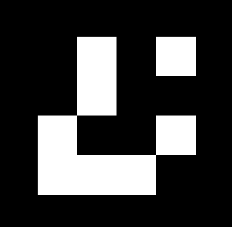

# INSTRUCCIONES

## Jugar con la mano

** IMPORTANTE
** TU ORDENADOR TIENE QUE TENER UNA CÁMARA FUNCIONAL PARA PODER JUGAR A ESTE JUEGO

Este juego consiste en controlar la bola con tu mano y esquivar los obstaculos, que cada vez son más rapidos, todo el tiempo que puedas para ir aumentando tu puntuación.

Para controlar la bola tendras que colocar tu mano en frente de la cámara, ahora solo tendras que mover la mano para que la bola se mueva con tu mano y asi esquivar los obstaculos.

La bola dejara de moverse si has sacado la mano fuera de la vision de la cámara.

## Jugar con la voz

** IMPORTANTE
** TU ORDENADOR TIENE QUE TENER UN MICRÓFONO FUNCIONAL PARA PODER JUGAR A ESTE JUEGO

Este juego consiste en controlar la bola moviendola a donde tu le digas.

Para controlar la bola tendras que decirle lo siguiente:

    - arriba: Para que la bola se mueva hacia arriba
    - abajo: Para que la bola se mueva hacia abajo
    - izquierda: Para que la bola se mueva hacia la izquierda
    - derecha: Para que la bola se mueva hacia la derecha
    - detente: Para que la bola se deje de mover

Tienes que tener en cuenta que una vez que mandes la bola a una dirección, esta no se detendra a menos que haya llegado al límite de la pantalla o le hayas dicho "detente".

## Cambiar el color

** IMPORTANTE
** TU ORDENADOR TIENE QUE TENER UNA CÁMARA FUNCIONAL PARA PODER CAMBIAR EL COLOR DE LA BOLA

Este opción no es un juego, mediante un código ArUco podras cambiar el color de la bola con la que vas a jugar.

Para cambiar el color, tendras que enseñarle uno de estos códigos a la cámara:

### ** ROJO

### ** VERDE

### ** AZUL

### ** CIAN

### ** AMARILLO

### ** MAGENTA
